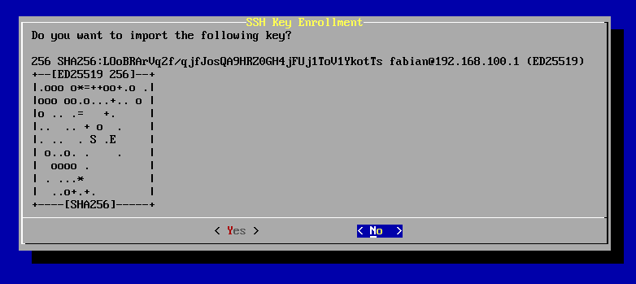

# Passwordless SSH key exchange through pairing

This tool allows to use pairing (like bluetooth, kde connect, ...) for exchanging public SSH keys, basically as alternative to `ssh-copy-id`.

With this, setting up SSH authentication is more user friendly, as the user's public key does not need to be transferred to the server manually.

It is arguably also more secure, as no passwords are involved, not even temporarily just to be able to `ssh-copy-id`.

`ssh-pairing-server` is designed to be used as part of some CLI or TUI like the bundled `ssh-pairing` tool, but can also be used manually.

## Build and Install

[meson](https://mesonbuild.com/) and [libssh](https://www.libssh.org/) are needed for building.
To use the `ssh-pairing` tool, [dialog](https://invisible-mirror.net/dialog/dialog.html) is needed during runtime.

```
> meson setup build
> ninja -C build install
```

## Example using `ssh-pairing`

On the server, run `ssh-pairing` as root. It will pause a possibly running `sshd.service`, show all needed info for establishing a connection from a client and allow selection of keys to import.

 

## Manual Example

On the server, display the IP address (or hostname) and the host key fingerprints, stop sshd if necessary, then start ssh-pairing-server:

```
> hostname -I # Get IP(s) to connect to
10.168.7.84
# Print host keys for verification
> for i in /etc/ssh/ssh_host_*key.pub; do ssh-keygen -l -f "$i"; done | awk '{ print $2" "$4 }'
SHA256:L1fVseOYAAAyufsAskcWeKDgAlE4KJ9uCIIly0RXk3I (ECDSA)
SHA256:68fgeoCzfSPPTLbSW272DnLYER2Z9S3w8h2GDEcjg7c (ED25519)
SHA256:MTg+iT5vx0JojrBuOTrN4/MdDv0kL390byaC5iPHymE (RSA)
> systemctl stop sshd # Stop sshd if running to free port 22
> sudo ssh-pairing-server
(no output yet)
```

On the client, connect to the server, compare the host key and confirm if they match. This validates the identity of the host to the client.

```
> ssh -oUserKnownHostsFile=/dev/null 10.168.7.84
The authenticity of host '10.168.7.84 (10.168.7.84)' can't be established.
ED25519 key fingerprint is SHA256:68fgeoCzfSPPTLbSW272DnLYER2Z9S3w8h2GDEcjg7c.
This key is not known by any other names.
Are you sure you want to continue connecting (yes/no/[fingerprint])? yes
Warning: Permanently added '10.168.7.84' (ED25519) to the list of known hosts.
Received 3 public keys
Connection reset by 10.168.7.84 port 22
```

It's important to look for the "Received X public keys" message, which confirms that this particular connection got accepted by ssh-pairing-server.

On the server side, the received public keys were printed and the server exited. If sshd was stopped previously, it can be started again. The keys from the ssh-pairing-server output can be appended to `~/.ssh/authorized_keys` for any user.

```
> sudo ssh-pairing-server
ssh-rsa AAAAB3NzaC1[...]2kmUzqvo6z4Po8= fvogt@10.168.7.84
ssh-ed25519 AAAAC3NzaC1[...]yRQQ77meqkf fvogt@10.168.7.84
ssh-rsa AAAAB3NzaC1[...]FTVrVbxNMPsago7 fvogt@10.168.7.84
> systemctl start sshd # If stopped previously
```

Note: Do not write the output of ssh-pairing-server into `~/ssh/authorized_keys` directly in case someone else attempts to connect. To protect against this, only a single client can connect and get the success message saying "Received X public keys". A full UI must ask the user for confirmation on the server after connection.

## How it works

When connecting to an SSH server, the SSH client offers all available public keys to the server and asks whether they can be used for authentication. If none of them are accepted, it falls back to other authentication methods like `keyboard-interactive`.

This tool uses libssh to implement an SSH server using the real host key of the SSH server and listens on the target port on the server. It records all public keys offered by the client to write them to stdout later, in a format suitable for `authorized_keys`. When the client falls back to `keyboard-interactive`, the server sends a status message to the client and ends the connection.

The "comment" field for each key in the output consists of the requested target user (defaults to the username of the client if not specified) and the IP address of the client.
